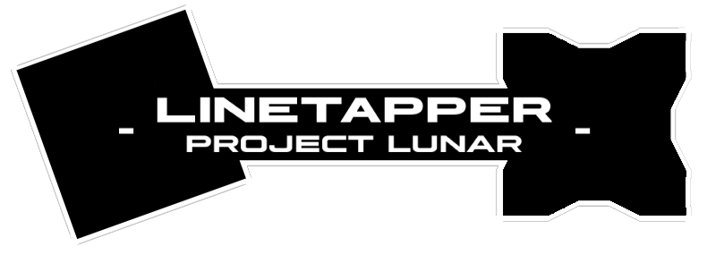

# LineTapper: Project Lunar

A rhythm game project by CoreCat.
Project Lunar by ZSolarDev.
> Made using [HaxeFlixel](https://haxeflixel.com/)

## Building Guide
> [!WARNING]  
> The game is still active in Development, so there might be a lot of stuff changing from time to time.
> Project Lunar is still very new, so new features might be buggy.

## Information
> This is a project CoreCat started making in June 17th 2024, It's inspired by this weird thing while CoreCat was playing Roblox, lol.

> I made Project Lunar to add even more features to LineTapper that either:
> 1. Should be added to the OG game(I'll make pr's for.)
> 2. Are things I think would be cool, but maybe not fully lining up with the OG game.
> If you have anything you would like to tell me, contact me at my discord: @zsolar1.
> If you find any bugs, make an Issue.
